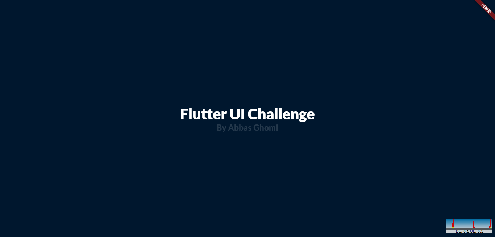
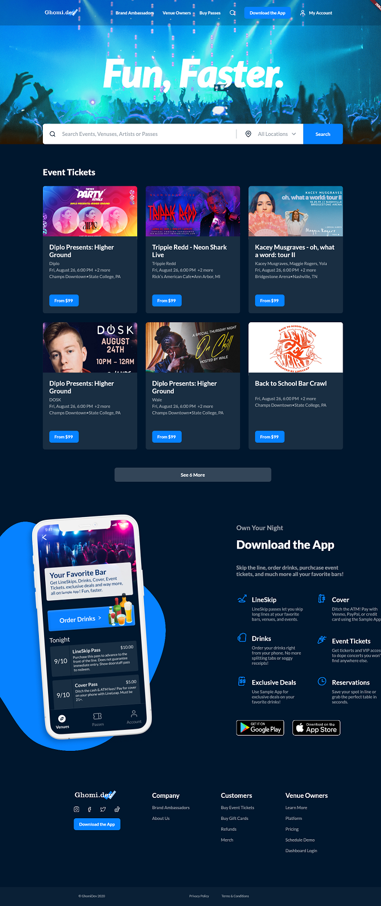

# Flutter UI challenge

project progress:
- implemented ui config class
- added linter dependency
- added google fonts dependency
- added reviewed asset images
- interface implemented based on design
- made top menu clickable
- implemented font resize limit 
- implemented and added splash page
- added mouse scroll behavior
- responsiveness revised but still WIP
- readme updated
- code refactor
- commits squashed for easier review
